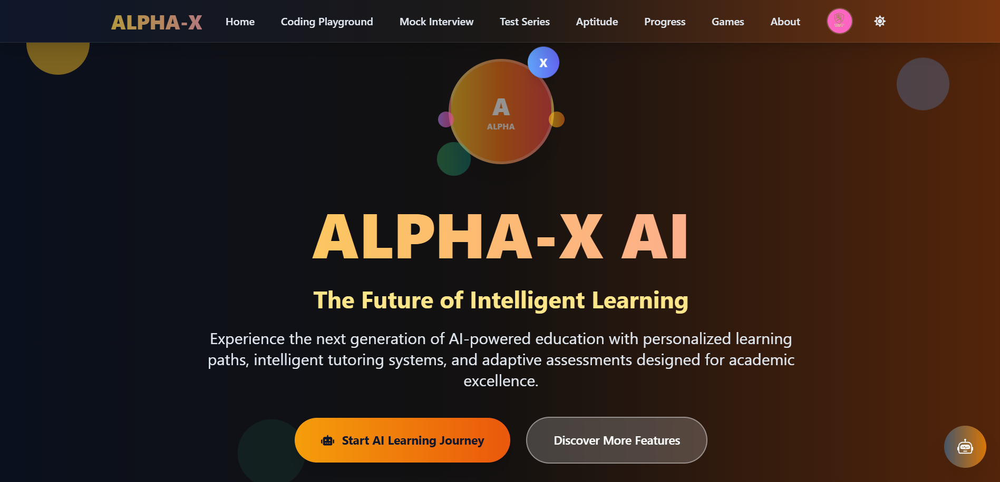

# 🤖 AI-Based Tutoring Platform  

  
  
  
  
  
  
  

An intelligent tutoring system that helps students learn more effectively with **AI-powered tools**.  
This project provides **personalized education**, **mock interview practice**, **AI code editor**, and **progress tracking** — all in one place.  

---

## 🚀 Features  

- 📚 **Study Materials** – Notes, PDFs, and previous year question papers.  
- 🎥 **Video Lectures** – Organized by branch and year, embedded directly.  
- 🧠 **Harsha AI (Chatbot)** – AI-powered tutor for instant doubt-solving.  
- 💻 **AI Code Editor** – Write, run, and test code online.  
- 🎤 **Mock Interview** – AI evaluates your answers with real-time feedback.  
- 📊 **Progress Tracker** – See how much you’ve studied and what’s left.  
- 📞 **Student Support** – Book one-to-one mentoring video calls.  

---

## 🌐 Live Demo  

🔗 [Visit the Website](https://tutoringbyai.netlify.app/)  

---

## 🖼️ Screenshots  

### 🔹 Homepage  
  

### 🔹 Coding Playgroung 
 

### 🔹 MOckInterview
 

### 🔹  Chatbot  
  

### 🔹 Progress Tracker  
  

---

## 🛠️ Tech Stack  

| Technology | Purpose |
|------------|---------|
| **React.js** | Frontend (UI/UX) |
| **Flask (Python)** | Backend Framework |
| **MySQL (XAMPP)** | Database |
| **HTML, CSS, JavaScript** | Core Web Development |
| **AI/ML (Python)** | Chatbot & Interview Evaluator |

---

## 📂 Project Structure  

  

AI-Based-Tutoring/
│── frontend/ # React frontend
│── backend/ # Flask backend
│── app.py # Main Flask app
│── requirements.txt # Python dependencies
│── README.md # Project documentation


---

## ⚡ Getting Started  

### 1️⃣ Clone the Repository  
```bash
git clone https://github.com/Harsha-pandey9/Ai-Based-Tutoring-.git
cd Ai-Based-Tutoring


cd backend
pip install -r requirements.txt
python app.py


cd frontend
npm install
npm start

👨‍💻 Author

Harsha Pandey
🎓 BTech in Artificial Intelligence & Machine Learning
🌐 GitHub
